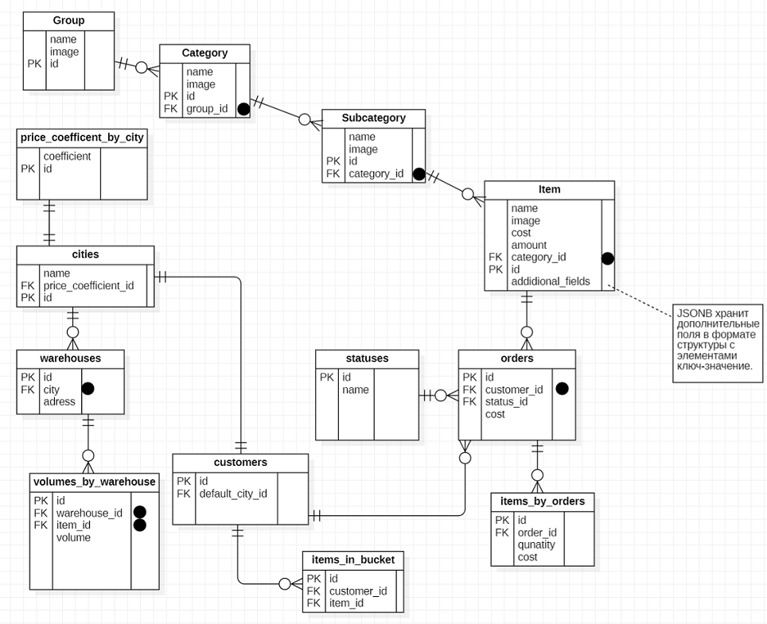
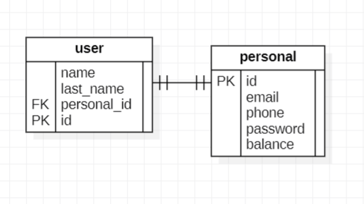
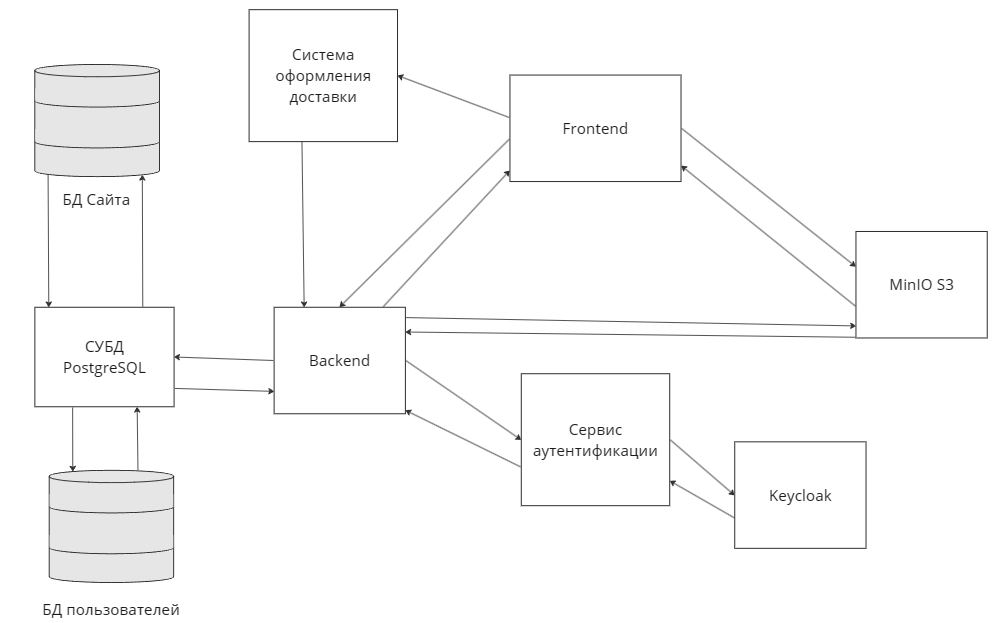

## Техническое задание

Тебя назначили архитектором нового проекта - интернет-магазина крупного ритейлера, который работает во всех городах России.
На сайте будет представлено большое разнообразие товаров: от книг и игрушек до еды и косметики.
После встречи с заказчиком, в рамках первого этапа разработки, были вынесены основные тезисы:
1. Интернет-магазин имеет 3 функциональных блока: личный кабинет пользователя, каталог товаров, административный модуль ("админка").
2. Каталог товаров организован в древовидную структуру: **группа -> категория -> подкатегория**.
Эта структура управляется через админку контент-менеджерами.
У каждого элемента структуры есть название, изображение.
Товар находится на уровне подкатегории. Причем, он может находиться только в одной подкатегории.
Например: "Мужчинам" -> "Одежда" -> "Джемперы" -> товар "Джемпер мужской синий р44".
Подкатегория может принадлежать только одной категории. А категория, в свою очередь, только одной группе.
3. Товары  создаются и редактируются в админке.
При создании товара обязательно указать его название, изображение, цену и количество данного товара на складах.
У товара могут быть дополнительные поля (вес, новый/б.у, длина, ширина и т.п.), причем, у разных товаров могут быть разные поля.
Например, у книг - это тип обложки и количество страниц, а у еды - это ккал и БЖУ.
4. При входе в интернет-магазин, пользователя обязательно попросят выбрать город.
В разных городах цена на один и тот же товар может различаться.
В каждом городе 1 и более складов. Один и тот же товар может быть в большом количестве на одном складе и отсутствовать на другом.
Данные о складах и количествах товара так же задаются в админке.
5. Чтобы оформить заказ, пользователь должен зарегистрироваться. Товары можно положить в "Корзину" и потом оформить доставку.
6. За доставку заказа отвечает внешняя логистическая система. В ней можно только зарегистрировать доставку и получить ее статус.
7. В каталоге товаров должен быть полнотекстовый поиск по товарам.
8. Данные о товарах обновляются не очень часто. Также есть жесткие требования ко времени отклика запросов к каталогу товаров.

Необходимо:
1. Выбрать базу данных (реляционная, документоориентированная, ключ-значение и т.п.). Возможно использование нескольких баз данных.
Описать схему данных.
Решить, где будет храниться медиаконтент. 
Свое решение необходимо обосновать, описать плюсы и минусы.
2. Нарисовать схему, в которой будут показаны все компоненты системы и их взаимодействие: функциональные модули, базы данных, внешние системы и т.п.
3. Реализовать прототип API по оформлению заказа: прописывать код полностью не надо, достаточно в виде верхнеуровневого наброска на PHP - интерфейсы, классы, методы без реализации.
Поскольку это тестовое задание - от вас не требуется знание всех в мире фреймворков и новомодных БД.
Основное - это умение перевести условия задачи на технологии, с которыми вы работали или просто знакомы.
4. Загрузите решение (текстовый файл с описанием прототипа, PHP-код, ссылка на схему и т.п.) в репозиторий на github/gitlab/bitbucket и приложи ссылку на него в ответ.
Не забудь разрешить доступ.

## Реализация

#### 1. Выбор базы данных. Описание схемы данных. Решение по хранению медиаконтента
**Выбор базы данных**

В качестве базы данных (БД) нами была выбрана реляционная БД
Причиной такого выбора послужили следующие факторы:
- хорошая теоретическая база данной модели;
- простота использования;
- наличие единого языка запросов SQL.

В качестве подходящей для данного проекта системы управления релояционной базой даннных (РСУБД)
мы решили выбрать PostgreSQL. 

Плюсы:
1. Высокая производительность: PostgreSQL известен своей высокой производительностью, особенно при работе с большими объемами данных.
2. Масштабируемость: PostgreSQL может масштабироваться как вертикально (увеличение мощности одного сервера), так и горизонтально (распределение нагрузки между несколькими серверами).
3. Надежность: PostgreSQL имеет надежную архитектуру и механизмы восстановления данных, что делает его надежным выбором для критически важных приложений.
4. Поддержка ACID-транзакций: PostgreSQL поддерживает ACID-транзакции (Atomicity, Consistency, Isolation, Durability), что гарантирует целостность данных при одновременном доступе.
5. Расширяемость: PostgreSQL имеет обширную экосистему расширений, которые позволяют добавлять дополнительные функции, такие как пространственные данные, полнотекстовый поиск и машинное обучение.
6. Открытый исходный код: PostgreSQL является открытым исходным кодом, что дает пользователям свободу использования, модификации и распространения программного обеспечения.
7. Большой набор типов данных и возможность создавать собственный: PostgreSQL позволяет использовать как примитивные типы данных, так и более сложные структуры, например, массивы, XML, JSON, JSONB и так далее. При необходимости имеется возможность создания собственных типов данных, что может помочь в оптимизации производительности обработки пользовательских или определенных форматов данных.   

Минусы:
1. Сложность администрирования: PostgreSQL может быть сложнее в администрировании, чем некоторые другие СУБД, особенно для начинающих пользователей, например по сравнению с MySQL.
2. Высокие требования к ресурсам: PostgreSQL требует больше ресурсов (ЦП, память), чем некоторые другие СУБД, особенно при работе с большими объемами данных.
3. Ограниченная поддержка NoSQL: PostgreSQL в первую очередь является реляционной СУБД и имеет ограниченную встроенную поддержку для NoSQL-функций, таких как документы и графы.
4. Некоторые ограничения масштабирования: PostgreSQL может масштабироваться горизонтально, но он может иметь некоторые ограничения при работе с очень большими объемами данных, требующими распределенной обработки.

Для хранения медиаконтента была выбрана готовая реализация системы хранения MinIO S3. Она позволит повысить производительность работы системы с помощью распределения нагрузки на уже готовое решение.

Плюсы:
1. Совместимость с Amazon S3: MinIO S3 полностью совместим с интерфейсом программирования приложений (API) Amazon S3, что позволяет приложениям и сервисам, разработанным для Amazon S3, работать с MinIO без каких-либо изменений.
2. Высокая производительность: MinIO S3 оптимизирован для высокой производительности и может обрабатывать большие объемы данных с низкой задержкой.
3. Масштабируемость: MinIO S3 может масштабироваться как по горизонтали (добавление дополнительных узлов), так и по вертикали (увеличение мощности отдельных узлов), что позволяет использовать его для хранения больших объемов данных.
4. Надежность: MinIO S3 имеет надежную архитектуру и функции восстановления данных, что делает его надежным выбором для хранения критически важных данных.
5. Бесплатное и с открытым исходным кодом: MinIO S3 является бесплатным и имеет открытый исходный код, что позволяет пользователям использовать, модифицировать и распространять программное обеспечение.

Минусы:
1. Ограниченная функциональность: MinIO S3 не поддерживает некоторые функции, доступные в коммерческих сервисах хранения объектов, таких как Amazon S3, например, управление жизненным циклом объектов или шифрование на стороне сервера по умолчанию.
2. Менее зрелый для облачных сред: MinIO S3 несколько менее зрелый для работы в облачных средах по сравнению с коммерческими сервисами хранения объектов, такими как Amazon S3 или Azure Blob Storage.
3. Требования к администрированию: MinIO S3 требует некоторого администрирования и настройки, особенно при развертывании и масштабировании кластера.
4. Меньшая экосистема: MinIO S3 имеет меньшую экосистему инструментов и интеграций по сравнению с коммерческими сервисами хранения объектов.
5. Ограничения масштабирования: Хотя MinIO S3 может масштабироваться, он может иметь некоторые ограничения при работе с очень большими объемами данных, требующими распределенной обработки.

**Описание данных**

Так как наша модель описания данных является реляционной, то наиболее подходящим способом представления мы решили выбрать ER диаграмму.
На представленной схеме данных БД магазина мы изобразили необходимые таблицы с указанием полей и ключей (PK и FK), типы связей между сущностями и дополнительные требуемые компоненты для реализации согласованного хранения, извлечения, вставки и удаления данных из БД.

Ниже представлена примитивная БД пользователей для хранения персональных данных. В целях безопасности она выделена как отдельный компонент.

\* Черный круг обозначает наличие INDEX у таблицы, он позволяет повысить скорость поиска необходимых данных в таблице. В нашем случае его влияние особенно важно для увеличения производительности поиска товаров в системе.

\** Поле additional_fields имеет тип данных JSONB - это один из наиболее подходящих способов создания нетипичных полей (свойств сущностей). Стоит отметить, что у него также имеются преимущества и недостатки. Но главное его преимущество - это гибкость.

Данный формат позволяет изменять цену товара для пользователя в любом городе на цену установленную для его города при использовании коэфициента 
Возможно извлечение необходимой информации 
#### 2. Схема со всеми компонентами системы.

#### 3. Прототип API по оформлению заказа

**Реализация прототипа API на PHP находиться в директории:** `src/order_maker`
